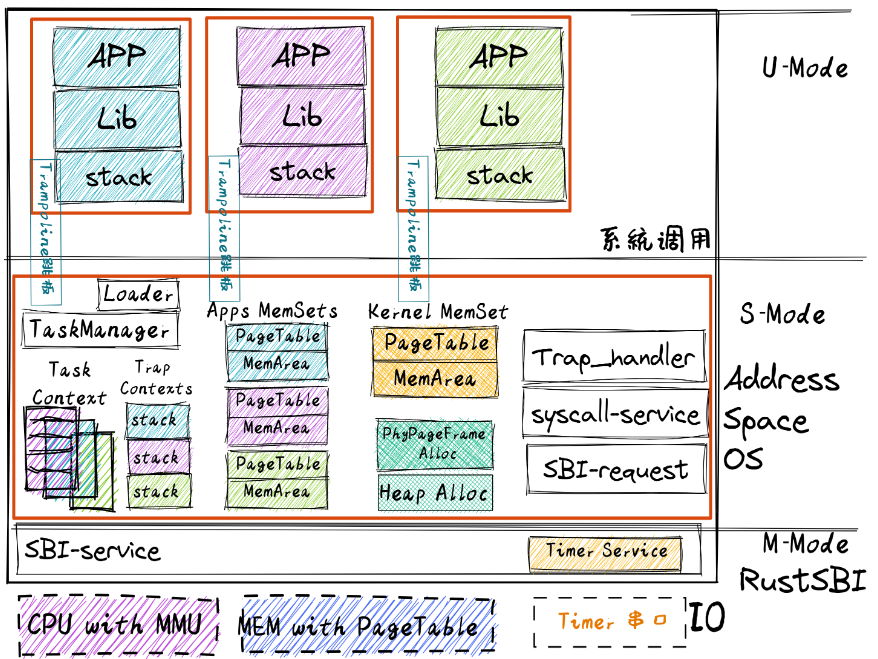
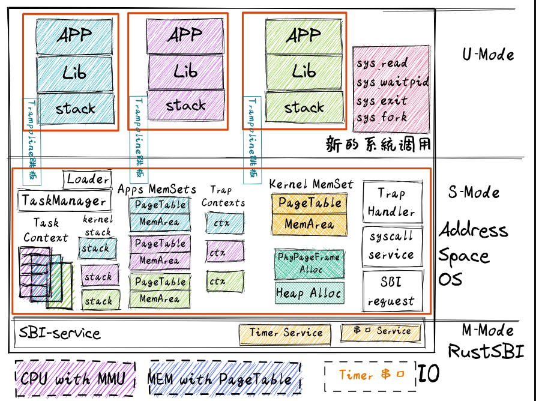
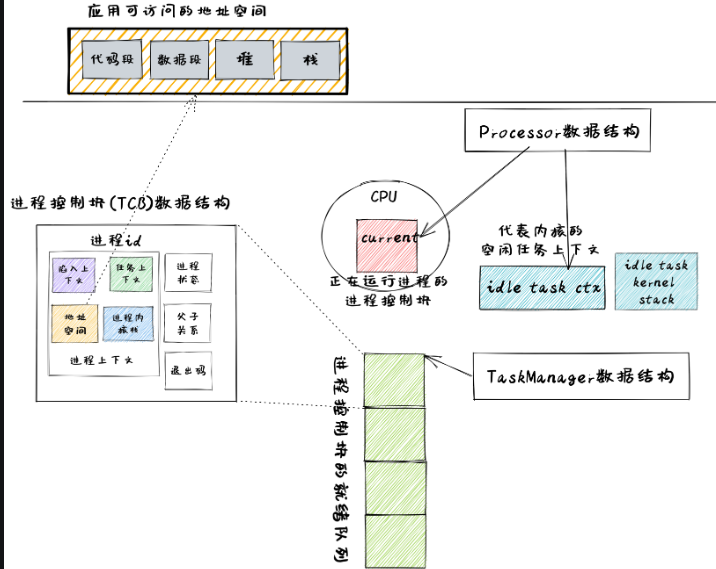
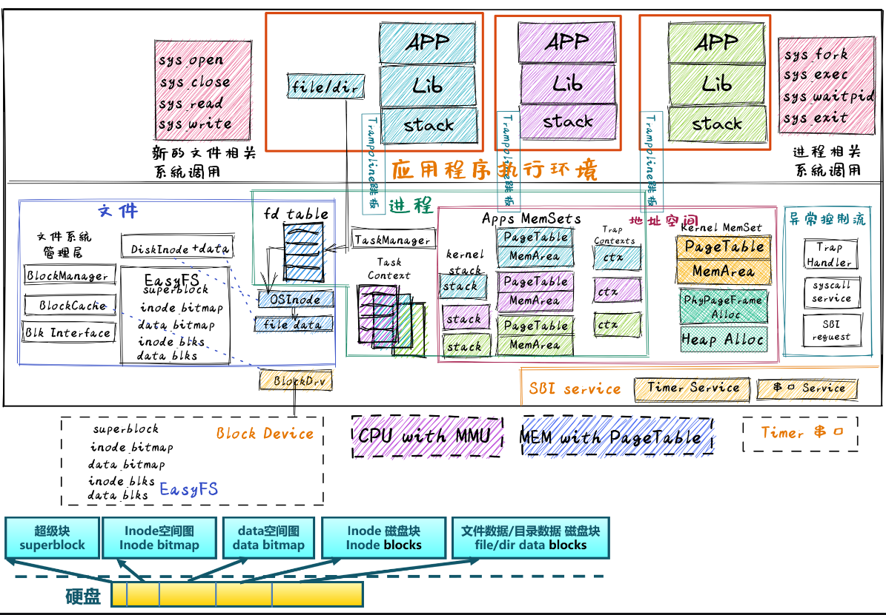
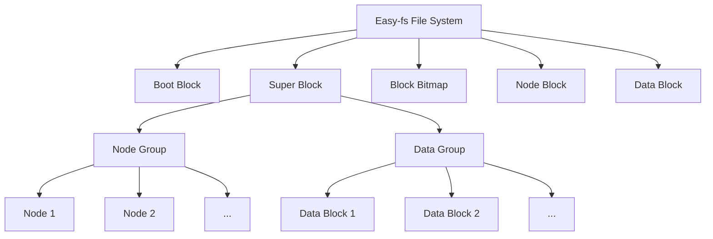
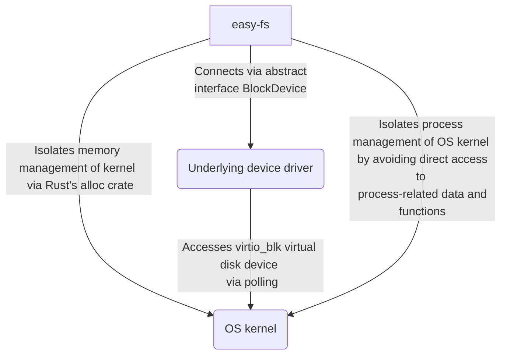
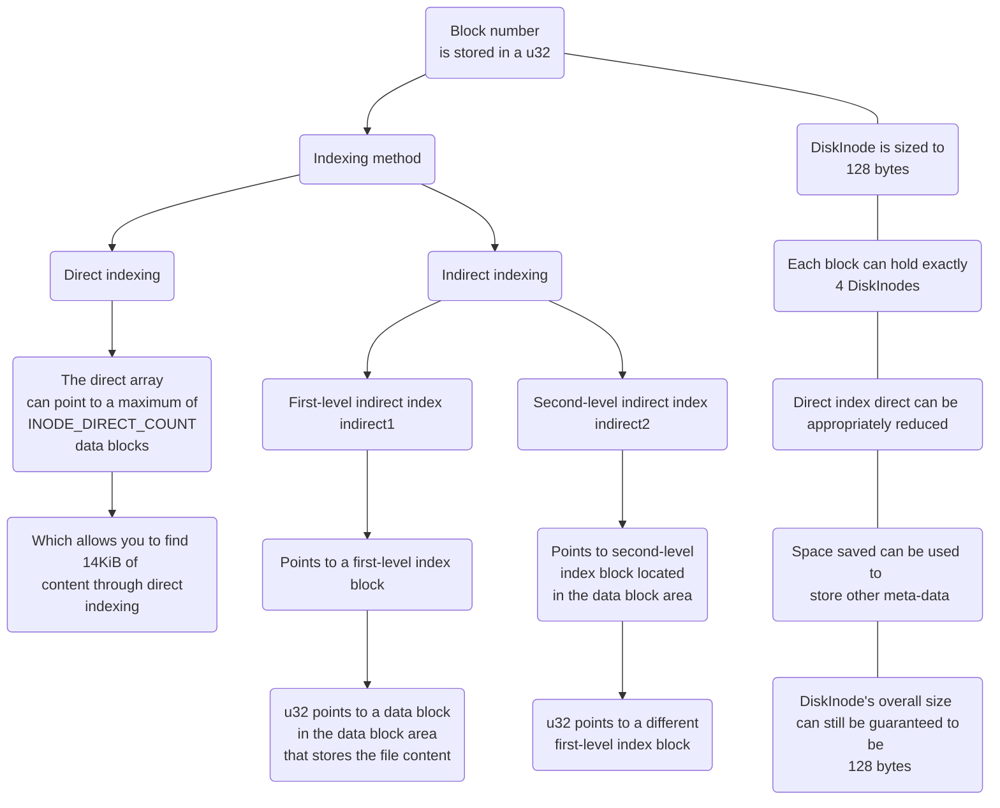
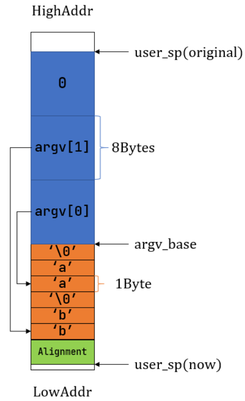
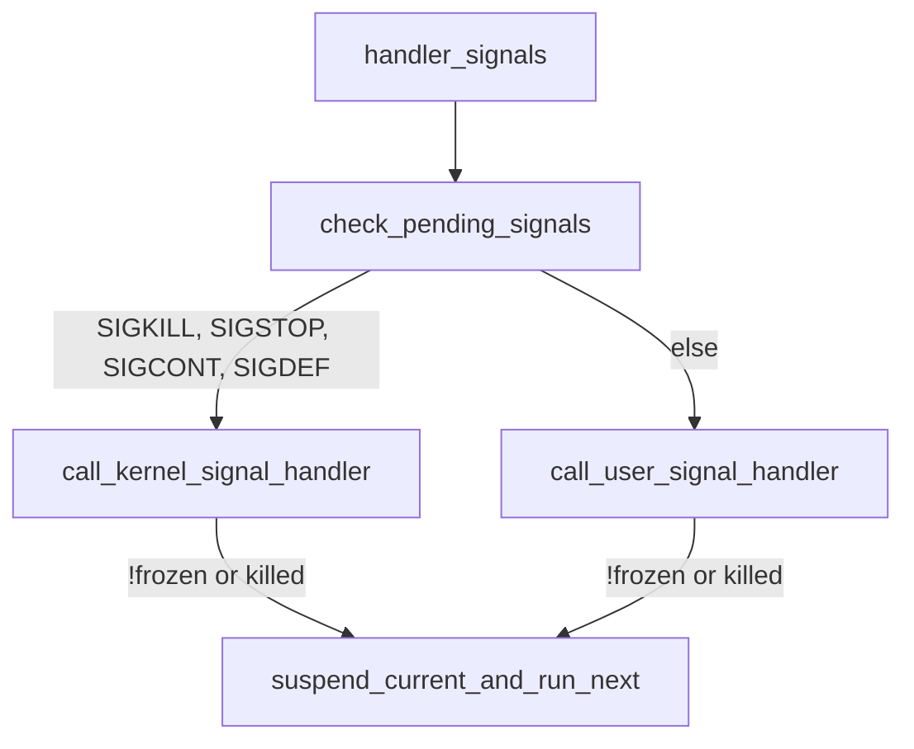
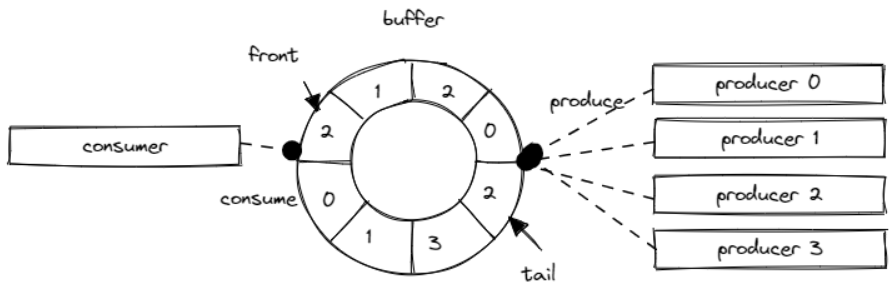

<!-- @import "[TOC]" {cmd="toc" depthFrom=1 depthTo=6 orderedList=false} -->

<!-- code_chunk_output -->

- [rCore on Windows platform](#rcore-on-windows-platform)
  - [Installation](#installation)
  - [chapter](#chapter)
    - [Basic environment to run application](#basic-environment-to-run-application)
      - [Function Call Context:](#function-call-context)
    - [With batch system](#with-batch-system)
      - [TrapContext](#trapcontext)
    - [Multiprogramming and Time-Sharing Multitasking](#multiprogramming-and-time-sharing-multitasking)
      - [Interrupt of RISC-V:](#interrupt-of-risc-v)
    - [Address Space](#address-space)
      - [Rust data structures in heap:](#rust-data-structures-in-heap)
      - [Smart Pointer / Container memory layout:](#smart-pointer--container-memory-layout)
      - [Address Virtualization:](#address-virtualization)
      - [Segmented memory management:](#segmented-memory-management)
      - [Paged memory management:](#paged-memory-management)
      - [Concept:](#concept)
      - [Address Format:](#address-format)
      - [PTE, Page Table Entry:](#pte-page-table-entry)
      - [Multilevel page table:](#multilevel-page-table)
      - [Application address space:](#application-address-space)
    - [Process os](#process-os)
      - [TaskControlBlock(PCB):](#taskcontrolblockpcb)
      - [Implement process management:](#implement-process-management)
      - [In process scheduling mechanism:](#in-process-scheduling-mechanism)
      - [Exec a new application:](#exec-a-new-application)
    - [File system](#file-system)
      - [Easy-fs:](#easy-fs)
      - [Block Device Interface Layer:](#block-device-interface-layer)
      - [Block Cache Layer:](#block-cache-layer)
      - [Disk Layout And Data Structures:](#disk-layout-and-data-structures)
      - [Easy File System(efs.rs):](#easy-file-systemefsrs)
      - [Inode(vfs.rs):](#inodevfsrs)
      - [Kernel Inode Layer:](#kernel-inode-layer)
      - [File Description Layer:](#file-description-layer)
    - [Pipe And Signal](#pipe-and-signal)
      - [Pipe:](#pipe)
      - [Redirect standard I/O:](#redirect-standard-io)
      - [Signal handle process:](#signal-handle-process)
      - [Signal Mechanisms:](#signal-mechanisms)
      - [Signal generation:](#signal-generation)
      - [Signal handle:](#signal-handle)
    - [Thread and Synchronous](#thread-and-synchronous)
      - [multiple threads in user mode:](#multiple-threads-in-user-mode)
      - [multiple threads in kernel mode:](#multiple-threads-in-kernel-mode)
        - [thread metadata structure:](#thread-metadata-structure)
        - [process metadata structure:](#process-metadata-structure)
        - [our manager offers interfaces:](#our-manager-offers-interfaces)
      - [mutex:](#mutex)
        - [blocking and wakeup:](#blocking-and-wakeup)
      - [semaphore:](#semaphore)
        - [consumer(s) and producer(s):](#consumers-and-producers)
      - [condvar:](#condvar)
        - [wakeup operation ways:](#wakeup-operation-ways)
        - [barrier:](#barrier)

<!-- /code_chunk_output -->
# rCore on Windows platform

## Installation

- rust : download rust from the default settings, and then set `rust-toolchain.toml` to specified the `nightly` version.
- qemu : the `qemu` version must be `7.0.0` [download the qemu](https://qemu.weilnetz.de/w64/2022/qemu-w64-setup-20220419.exe), otherwise, the startup address won't be `0x0000000`.

needing tools:

```cmd
rustup target add riscv64gc-unknown-none-elf
cargo install cargo-binutils
rustup component add llvm-tools-preview
rustup component add rust-src
```

and the gdb tool: [link](https://static.dev.sifive.com/dev-tools/riscv64-unknown-elf-gcc-8.3.0-2020.04.1-x86_64-w64-mingw32.zip)

## chapter

### Basic environment to run application


Here we implement the basic environment to run a application, print a "hello world" string at the qemu simulator console.

We remove the standard library of rust, only using the core library, and setting the `panic_handler`.

Introduction relevant bootstrap process in qemu.

In order for the implementation to properly interface with Qemu,
we can adjust the behavior of the linker through Linker Script(src/linker.ld) and set config(.cargo/config)

The basic theory of stack and calling the function in assemble.

```
jal  rd, imm[20:1]
rd <- pc + 4
pc <- pc + imm

jalr rd, (imm[11:0])rs
rd <- pc + 4
pc <- rs + imm


rs:  Source Register
rd:  Destination Register
(x0 ~ x31)

imm: Immediate
```

#### Function Call Context:

- Callee-Saved: used by callee
- Caller-Saved: used by caller

Register:
| register                     | saver  |
| ---------------------------- | ------ |
| a0 ~ a7(x10 ~ x17)           | callee |
| t0 ~ t6(x5 ~ x7, x28 ~ x31)  | callee |
| s0 ~ s11(x8 ~ x9, x18 ~ x27) | caller |

zero(x0), ra(x1), sp(x2), fp(s0), gp(x3), tp(x4)


### With batch system


SEE: Supervisor Execution Environment

AEE: Application Execution Environment

Privilege-level software and hardware co-design

- `ecall`
- `eret`

privilege command:

- `sret`: S return to U.
- `wfi`: waiting for interrupt.
- `sfence.vma`: reflash TLB cache.
- visit `spec/stvec/scause/sscartch/stval/sstatus/stap` CSR instruction

and then, we write 5 program which running on user-space.

these programs can be test in linux platforms with `qemu-riscv64`, which the command can not find in windows.

The cache made by the CPU on the physical memory is divided into two parts:

- the data cache (d-cache)
- the instruction cache (i-cache)
  which are used when the CPU accesses and fetches the memory respectively.

Here we only notice that the privilege-level change only between RISCV-U and RISCV-S.

|csr name| function with Trap|
CSR(Control and status register)
|---|---|
|sstatus| current privilege-level type info|
|spec|if the current trap is an exception,record the last instruction address|
|scause|the reason for this trap|
|stval|the additional information about this trap|
|stvec|the entry point address of trap handler code|

```
stvec = MODE[1:0] + BASE[63:2]
MODE == 0 - Direct Mode
MODE -> Vectored
```

ecall -> u - Trap into - S

- sstatus.SPP -> U/S
- spec Trap next instruction address
- scause/stval record information
- CPU -> stvec, privilege-level set as S

sret -> s -> u

- sstatus.SPP -> U/S
- CPU -> spec

User stack and Kernel stack(Just wrapping the bytes array).

#### TrapContext

```rust
#[repr(C)]
pub struct TrapContext {
    pub x: [usize; 32],
    pub sstatus: Sstatus,
    pub sepc: usize,
}
```

General purpose register `x0~x31`, `sstatus`, `spec`.

The overall process of `Trap` processing is as follows:

- First save the Trap context on the kernel stack by `__alltraps`.
- Jump to `trap_handler` functions written in Rust to complete Trap distribution and processing.
- When `trap_handler` returns, use `__restore` to recover registers from the Trap context stored on the kernel stack.
- Finally, return to the application for execution through a `sret` instruction.

Instructions for reading and writing CSR are a class of instructions that can
complete multiple read and write operations without interruption.

### Multiprogramming and Time-Sharing Multitasking


We use python to build the linker script, we replace the application
start address with the correct address which i-th application should place
on.


Considering an one-time execution application as a `task`,
an `execution segment` or `idle segment` on a time segment
in the application execution process is called a
`computing task slice` or `idle task slice`.

Switching tasks from one program to another is called `task switching`.

The control flow between `Task switching` and `Trap` :

- It does not involve privilege level switching
- Part of it is done with the help of the compiler
- Same as `Trap`, it is transparent to the application

In fact, `Task switching` is a switch between the `Trap control flow` in the kernel from two different applications.

when an application trap into S-mode, this trap control flow can call
a special function `__switch`. After the `__switch` return, it will continue to execute the follow program segment.

That means the previous trap control of application A flow will be paused
and switch out. Then CPU will handle another trap control of
application B. And then at the right time, the trap control flow of application A will be switch back from the trap control flow of application C (maybe not the pervious his switch to).

Function `__switch` will change the `stack`.

When we doing the switching operation, we should stored some registers (Task Context). The `Task Context` will stored at `TaskManager` as a `TaskControlBlock`, responsibly for saving the state of a task.

```c
TaskContext *current_task_cx_ptr = &tasks[current].task_cx;
TaskContext *next_task_cx_ptr    = &tasks[next].task_cx;
```


```rust
pub struct TaskContext {
  ra: usize,
  sp: usize,
  s: [usize; 12],
}
```

- `ra`: It records where the `__switch` function should jump to continue execution after returning, so that it can get to the correct position after the task switch is completed and ret.
- `sp`: kernel stack pointer of app.
- `s`: Stored s0 ~ s11.

A `TaskControlBlock` contains: `TaskStatus`, `TaskContext`.

#### Interrupt of RISC-V:

- Software Interrupt
- Timer Interrupt
- External Interrupt

In the privilege level of S, interrupt mask - CSR has `sstatus` and `sie`.
`sie` has three type of interrupts: `ssie` / `stie` / `seie`.

when the interrupt happen,

- `sstatus.sie` will save at `sstatus.spie`, and `sstatus.sie` clear as zero.
- after completion of interrupt handler, `sret` will return to the place interrupted by the interrupt and continue execution. Hardware will recover the `sstatus.sie` with the value of `sstatus.spie`.

In RISC-V 64 architectures, there is a 64-bit counter CSR `mtime`.
another 64-bit counter CSR `mtimecmp`, if the value of `mtime` is exceed `mtimecmp`, it will cause a **timer interrupt**.


### Address Space



#### Rust data structures in heap:

- `*const T / *mut T`
- `&T / &mut T`
- `Box<T>`
- `Rc<T> / Arc<T>`
- `RefCell<T>`
- `Mutex<TJk>`

#### Smart Pointer / Container memory layout:  


using the crate `buddy_system_allocator` as heap allocator. and use `#[global_allocator]` for Semantic items tagged.

`buddy_system_allocator::LockedHeap` has implemented `GlobalAlloc` interface.

we use a static mut bytes array(in kernel .bss segment), as the heap area.

#### Address Virtualization:


with the help of hardware:

```
virtual address -> CPU.MMU(Memory Management Unit) -> Physical address
                        Address Translation
```

#### Segmented memory management:


- Every application address size limited to a const number `bound`, that is, each application virtual address range from $[0, bound)$.
- physical address was split into several slots of the same size, except of the kernel reserved space.
- Each slot has the base address and the visitable range $[base, base + bound)$.

In this case, MMU only need two registers: `base` and `bound`. And use a `Bitmap` to show the slots using status.

However, it may waste too much memory resources(Internal Fragment).

do some improve with different base/bound:

however, it also may waste too much memory(External Fragment).

#### Paged memory management:


- kernel do physical memory manage base on page.
- each application virtual address can be divided into serval virtual page.
- available physical memory are divided into serval physical as Frame.
- each application address are consist of serval virtual pages.

#### Concept:

- VPN: Virtual Page Number
- PPN: Physical Page Number
- Each application has his own `Page Table`(existing in memory, managed by kernel), recording each virtual page mapping the actual physical Frame.
- The `Page Table`, Key is VPN, Value is PPN.
- set the protection bit `rwx`

```
(VPN, Offset) -> MMU -> (PPN, Offset)
```

Here, we use `SV39` provided by riscv architecture.

In default, MMU is disabled.Modify a CSR `satp` to enable it.
After that, address which S mode or U mode would be all consider as a virtual address.It needs to translate into a physical address by MMU, and then visit the physical memory.And address in M mode would be consider as physical address.

`satp`:


- MODE: 0-visit physical address/8-Sv39
- ASID: Address space identifier.
- PPN: The physical page number where the root page table is located.

#### Address Format:


#### PTE, Page Table Entry:


- V(Valid): valid if current bit is 1
- R(Read)/W(Write)/X(Execute)
- U(User)
- G
- A(Accessed)
- D(Dirty)

#### Multilevel page table:

Allocation on demand, and using the `trie` algorithm.

- v == 0 => nullptr
- v == 1 && R/W/X == 0 => valid page table entry, containing ptr point at next page table entry.
- v == 1 && R/W/X |!= 0 => valid page table entry, containing the physical page number corresponding to the virtual address.

sv39 address transformation:


TLB, Translation Lookaside Buffer

`sfence.vma` + virtual address, only refresh this relevant mapping.

In enabling the Page management, when kernel code want to visit a virtual address, it should leave it to MMU to do physical address conversion. Giving each application kernel stack, and a `Trampoline`.


Each kernel stack would reserve a `Guard Page` as empty hole.


#### Application address space:


[More About Address Space](http://rcore-os.cn/rCore-Tutorial-Book-v3/chapter4/7more-as.html)

### Process os





Process: An execution process of a program under the management of the operating system.

- fork: frok a new process, everything are same except `a0` register(function returns value), hard-code process: `initial Process`
- waitpid: when a process calling `exit` system call to exit the process. The resources it occupies cannot be fully recovered at once(process kernel stack). When the process exit, it will be set as `Zombie Process`. And then its father process will collect this process state and recycle all the resources it occupies through `waitpid`.
- exec: accepting a parameter `path: &str` similar to char\* in `C`.

Each process has it own unique `process identifier symbol`,

PidHandler(PidAllocator): allocator <-alloc/dealloc-> pid(usize).

KernelStack: contain a `pid`.

#### TaskControlBlock(PCB):

```rust
// immutable
pid: PidHandle,
kernel_stack: KernelStack

UPSafeCell {
  trap_cx_ppn: PhyPageNum,
  base_size: usize,
  task_cx: TaskContext,
  task_status: TaskStatus,
  memory_set: MemorySet,
  parent: Option<Weak<TaskControlBlock>>,
  children: Vec<Arc<TaskControlBlock>>,
  exit_code: i32,
}

```

- new(elf_data) -> TaskControlBlock
- exec(&self, elf_data)
- fork(self: &Arc<TaskControlBlock>) -> Arc<TaskControlBlock>

TaskManager: `Round Robin` algorithm

```rust
ready_deque: VecDeque<Arc<TaskControlBlock>>
```

Processor: Maintain CPU state

```rust
current: Option<Arc<TaskControlBlock>>,
idle_task_cx: TaskContext,
```

`run_task()`:
Here we cannot rely on the compiler to automatically recycle borrowing mark(task_inner, processor),
because we will call the `__switch` before the automatic recycle.

`schedule(switched_task_cx_ptr: *mut TaskContext)`:

```rust
unsafe {
  __switch(
      switched_task_cx_ptr,
      idle_task_cx_ptr,
  );
}
```

#### Implement process management:

- Create a initial process(initproc).

- Process scheduling mechanism, when process calling `sys_yield` to give up the right of using CPU,
  or the kernel swaps out the process that runs out of time slices allocated in this round and swaps in the next process.

- Process generation mechanism(sys_fork/sys_exec).

- Process resource recycling mechanism, when the process calling `sys_exit`, or error happened and being terminated by kernel(saving the exit code), its father process can collect the information of this process and recycle its resources by calling `sys_waitpid`.

- Character input mechanism, for supporting `user_shell` getchar(`sys_read`).

After the kernel has been initialized, adding `initproc` by `task` module.

we calling `TaskControlBlock::new` to create a process control block, it needs accept
a `elf` data slice(provided by `get_app_data_by_name` from `loader` module).

```
+---------------------+
|                     |
|   Analyze ELF file  |
|                     |
+----------+----------+
           |
           v
+----------+----------+
|                     |
|   Get Trap context  |
|                     |
+----------+----------+
           |
           v
+----------+--------------------+
|                               |
| Allocate PID and kernel stack |
|                               |
+----------+--------------------+
           |
           v
+----------+----------------+
|                           |
| Push initial task context |
|                           |
+----------+----------------+
           |
           v
+----------+-------------------+
|                              |
| Create process control block |
|                              |
+----------+-------------------+
           |
           v
+----------+--------------+
|                         |
| Initialize Trap context |
|                         |
+----------+--------------+
           |
           v
+----------+-------------------+
|                              |
| Return process control block |
|                              |
+----------+-------------------+
```

#### In process scheduling mechanism:

calling by `suspend_current_and_run_next()` from `task` module.

using in `sys_yield()` and `Interrupt::SuperiorTimer` match status.

In `suspend_current_and_run_next`, `take_current_task` take out the task currently running, then modify this process control block status, and then push it into the tail of the queue.

After that, calling `schedule` function to toggle the scheduling and switching task.

Fork a child process:

create a new memory_set by `form_exited_user()`, allocate a new `pid`, create a `kernel_stack`, set the trap_cx.`kernel_sp` -> `kernel_stack`.

```rust
Trap::Exception(Exception::UserEnvCall) => {
  // jump to next instruction anyway
  let mut cx = current_trap_cx();
->cx.sepc += 4;
  // get system call return value
  let result = syscall(cx.x[17], [cx.x[10], cx.x[11], cx.x[12]]);
  // cx is changed during sys_exec, so we have to call it again
  cx = current_trap_cx();
->cx.x[10] = result as usize;
}
```

```rust
pub fn sys_fork() -> isize {
  let current_task = current_task().unwrap();
  let new_task = current_task.fork();
  let new_pid = new_task.pid.0;
  // modify trap context of new_task, because it returns immediately after switching
  let trap_cx = new_task.inner_exclusive_access().get_trap_cx();
  // we do not have to move to next instruction since we have done it before
  // for child process, fork returns 0
->trap_cx.x[10] = 0;  //x[10] is a0 reg
  // add new task to scheduler
  add_task(new_task);
  new_pid as isize
}
```

#### Exec a new application:

replace current address with a new address space form by ELF.

```rust
// memory_set with elf program headers/trampoline/trap context/user stack
let (memory_set, user_sp, entry_point) = MemorySet::from_elf(elf_data);
```

There is no need to deal with the task context here,
because the process itself is already executing,
and only the suspended application needs to keep a task context on the kernel stack.

Recycling the resources by calling `exit_current_and_run_next()`.

setting child process status as `Zombie`, and then it will be recycled by its father
process with `waitpid`.

### File system

Code Tree:


#### Easy-fs:



In the diagram above, the Easy-fs file system consists of a `boot block`,
a `super block`, a `block bitmap`, `node blocks`, and `data blocks`.

- `boot block` is used to boot the file system,
- `super block` contains metadata information about the file system,
- `block bitmap` is used to record the usage of blocks,
- `node blocks` are used to store directory and file information,
- `data blocks` are used to store the actual data of files.

The `super block` contains information about `Node groups` and `Data groups`.
`Node groups` are used to store `Node blocks`, while data groups are used to store `Data blocks`.

- `Node blocks X` contain metadata information about files and directories,
  such as file name, file size, creation time, etc.
- `Data blocks X` store the actual data content of files.

Overall, the Easy-fs file system adopts a simple and effective design approach by storing the metadata and data of the file system in different areas to improve the reliability and performance of the file system.

add user lib systemctl call:

- `sys_open`
- `sys_close`

`easy-fs`: implement a simple file system layout.

`easy-fs-fuse`: is an application that can run in a development environment,
it can test `easy-fs`, or package the application developed for our kernel
as an easy-fs file system image.



#### Block Device Interface Layer:

```rust
// easy-fs/src/block_dev.rs

pub trait BlockDevice : Send + Sync + Any {
  // read the block which id equals to `block_id` data
  // from disk to memory.
  fn read_block(&self, block_id: usize, buf: &mut [u8]);
  // write the block which id equals to `block_id` with data,
  // from memory to disk.
  fn write_block(&self, block_id: usize, buf: &[u8]);
}
```

#### Block Cache Layer:

Every time we want to do read/write in a disk block, we should put the
block data onto a temporarily created cache area, writing it back after serval writing/reading operations.
But in the the consideration of effective, we should reduce the time of calling `read/write_block` as less as possible, because they incur a lot of overhead every time they are called. To do this, the key is to `merge` block reads and writes.

We have a `BLOCK_CACHE_MANAGER` to manage the caches we want to do operations,
it use FIFO, each time we have a willing the change a block with the id,
it will search the cache in its queue, if not matching, it will add it to the cache
or find a cache which the count of strong references is just equal to 1, and then replace it with the one we want. (if the upper bound is full, panic)

The exposed api, it just accept a closure conveniently:

```rust
impl BlockCache {
  pub fn read<T, V>(&self, offset: usize, f: impl FnOnce(&T) -> V) -> V {
    f(self.get_ref(offset))
  }

  pub fn modify<T, V>(&mut self, offset:usize, f: impl FnOnce(&mut T) -> V) -> V {
    f(self.get_mut(offset))
  }
}
```

#### Disk Layout And Data Structures:


Super Block: It is stored at the beginning of the block numbered 0 on the disk.

BitMap: In easy-fs layout, existing two type of bitmap,
managing index nodes and data blocks separately. Consisting of several blocks (each one: 512 bytes = 4096 bits). There are two state in each block record:

- 0: unallocated
- 1: allocated

bitmap should find a bit which its state is 0 to allocate out and recycle bit(inode/block).

DiskInode:
Each file/directory are stored as a `DiskInode` in disk.
including metadata: size(sizeof file/directory bytes), type\_(DiskInodeType),



Each files can be considered as servals of `DataBlock[u8;BLOCK_SZ]`,
But Directory must follow some special format, considering as a consequence, which is
a binary group, the first element is the name of this directory, and then is the number of Inode.

#### Easy File System(efs.rs):

Manage `Super Block`, `Inode Bitmap`, `Inode region`, `Data Bitmap` and `Data region`.

#### Inode(vfs.rs):

Explosive data structure.

```rust
pub struct Inode {
  block_id: usize,
  block_offset: usize,
  fs: Arc<Mutex<EasyFileSystem>>,
  block_device: Arc<dyn BlockDevice>,
}
```

Implement:

```rust
// efs
// Acquire the root inode
fn root_inode(efs: &Arc<Mutex<Self>>) -> Inode

// Inode
// Find the inode(Only called by directory)
fn find(name: &str) -> Option<Arc<Inode>>
fn find_inode_id(name: &str, disk_inode: &DiskInode) -> Option<u32>

// collect the files/directories name
fn ls() -> Vec<String>

// create a file in root inode
fn create(name: &str) -> Option<Arc<Inode>>

// clear the file (or open with `CREATE`)
fn clear()

// file read and write
fn read_at(offset: usize, buf: &mut [u8]) -> usize
fn write_at(offset: usize, buf: &[u8]) -> usize
fn increase_size(new_size: u32, disk_inode: &mut DiskInode, fs)
```

Testing the Efs system, with linux(current system):

using a file to emulate a block device.

After implementing the easy-fs file system,
we can finally package these applications into the easy-fs image and put them on disk. When we want to execute the application,
we only need to take out the application in the `ELF execution file` format from the file system and load it.

It can be executed in memory, which avoids the storage overhead and other problems in the previous chapters.

we using crate `virtio-divers` to support VirtIO block devices....

#### Kernel Inode Layer:

```rust
// Indicates a regular file or directory that is opened in the process
pub struct OSInode {
  readable: bool,
  writable: bool,
  inner: Mutex<OSInodeInner>,
}
pub struct OSInodeInner {
  offset: usize,
  inode: Arc<Inode>,
}
```

#### File Description Layer:

```rust
pub trait File: Send + Sync {
  /// If readable
  fn readable(&self) -> bool;
  /// If writable
  fn writable(&self) -> bool;
  /// Read file to `UserBuffer`
  fn read(&self, buf: UserBuffer) -> usize;
  /// Write `UserBuffer` to file
  fn write(&self, buf: UserBuffer) -> usize;
}

impl for OSInode {}
```

In order to supporting file management for Process,
add corresponding fields: `pub fd_table: Vec<Option<Arc<dyn File + Send + Sync>>>,`

And then add system call api:

- sys_open: process only open a file and return a writeable and readable fd to process.
- sys_close: process close the fd, guaranteeing legal access to documents.
- sys_read: process can read the contents to memory.
- sys_write: process can write the contents into the file.

File system initialization:

1. open the block device.
2. open the file system in block device.
3. acquire the root inode in file system.

### Pipe And Signal

IPCOS add two commination ways: Pipe and signal.

code Tree:


Everything in linux are file.

Implement `File trait` to `Stdin` and `Stdout` (meta structure).

- fd == 0 Standard Input
- fd == 1 Standard Output
- fd == 2 Standard Error Output

In process forking, child process should completely extend from father
process fd table, in order to share all files.

#### Pipe:

```rust
sys_pipe(pipe: *mut usize) -> isize;
```

Pipe is based on file:

```rust
pub struct Pipe {
  // read-end or write-end
  readable: bool,
  writable: bool,
  buffer: Arc<Mutex<PipeRingBuffer>>,
}
impl File for Pipe {}
```

And then, in a further warping:

```rust
enum RingBufferStatus {
    FULL,
    EMPTY,
    NORMAL,
}

pub struct PipeRingBuffer {
    arr: [u8; RING_BUFFER_SIZE],
    head: usize,
    tail: usize,
    status: RingBufferStatus,
    write_end: Option<Weak<Pipe>>,
}
```

`write_end`:
Keeps a weak reference count for its writes,
because in some cases it is necessary to confirm whether
all writes of the pipeline have been closed,
this is easy to confirm with this field.

providing two api in `Pipe`:

```rust
fn read_end_with_buffer(buffer: Arc<Mutex<PipeRingBuffer>>) -> Self
fn write_end_with_buffer(buffer: Arc<Mutex<PipeRingBuffer>>) -> Self
```

then in making up a pipe:

```rust
/// Return (read_end, write_end)
pub fn make_pipe() -> (Arc<Pipe>, Arc<Pipe>) {
  let buffer = Arc::new(Mutex::new(PipeRingBuffer::new()));
  let read_end = Arc::new(
    Pipe::read_end_with_buffer(buffer.clone())
  );
  let write_end = Arc::new(
    Pipe::write_end_with_buffer(buffer.clone())
  );
  buffer.lock().set_write_end(&write_end);
  (read_end, write_end)
}
```

Adding Command parameters and Redirecting the standard I/O:

modify the system call api:
`pub fn sys_exec(path: &str, args: &[*const u8]) -> isize;`

Since we want to pass the starting address of this vector to the kernel,
in order for the kernel to get the number of command line arguments,
we need to put a 0 at the end of the args_addr,
so that the kernel can know when it sees it.
The command line parameters have been obtained.

Then in `TaskControlBlock`, we push arguments on user stack,

such as : accepting "aa" and "bb":



At the same time, we also need to modify the `a0/a1` register in the Trap context, so that `a0` represents the number of command line parameters, and `a1` represents the starting address of the blue area argv_base in the figure.

#### Redirect standard I/O:

`sys_dup` : copy its a already open file reference and allocate a new fd point at this file.

```rust
pub fn sys_dup(fd: usize) -> isize {
  let task = current_task().unwrap();
  let mut inner = task.acquire_inner_lock();
  // check the fd validity
  if fd >= inner.fd_table.len() {
    return -1;
  }
  if inner.fd_table[fd].is_none() {
    return -1;
  }

  let new_fd = inner.alloc_fd();

  inner.fd_table[new_fd] = 
          Some(Arc::clone(inner.fd_table[fd].as_ref().unwrap()));

  new_fd as isize
}
```

The process of opening the file and replacing 
it takes place in the child process branch after the fork.
```rust
if !input.is_empty() {
  let input_fd = open(input.as_str(), OpenFlags::RDONLY);
  if input_fd == -1 {
    println!("Error when opening file {}", input);
    return -4;
  }
  let input_fd = input_fd as usize;
  close(0);
  assert_eq!(dup(input_fd), 0);
  close(input_fd);
}
```

signal: process should have `event notify` ability. software interrupt.

Signals is an asynchronous notification mechanism for inter-process communication in UNIX-like operating systems

The Receiver of signals is a process, having 3 ways to handle:
- ignored: ignore the signal.
- capture: call corresponding signal handler function.
- terminate: process exit

if some signals don't have its corresponding handler function, kernel
will handle it in default way.

#### Signal handle process:


signal has 2 sources come from: 

- at the beginning of process running, asynchronous signal.
- the execution trigger of the process itself, synchronous signal.

The kernel will check whether the process to be returned to has any signals pending before the Trap process is completed and is about to return to user mode. If it is required to handle, there are 2 ways:

- call the handler function provided by corresponding signal by `sigaction`, 
kernel will store the current process `Trap Context` in some place, and then return to the handler function in user mode. After this function is completed, calling `sigreturn` to restore the `Trap Context` and return user mode again to run next instruction.

- otherwise, kernel will solve this signal in default way, and then return to user mode to run next instruction.

#### Signal Mechanisms:
- `sys_sigaction`: set up a signal processing routine.
- `sys_procmask`: set the signal mask of the process.
- `sys_sigreturn`: clears the stack frame, returns from the signal processing routine.

Design and Implement Signaling Mechanisms:

In order to set up signal process routine, adding serval fields in `TaskControlBlock`:
```rust
pub signal_mask: SignalFlags,
pub signal_actions: SignalActions,
```

#### Signal generation:
- process send `kill` to itself or other process.
- kernel detect some events and then send the signal to process, 
but this event has nothing to do with the execution of the process receiving the signal, such as `SIGCHLD`.
- current process execution trigger some condition, then Trap into kernel handler, and then kernel send the corresponding signal to this kernel, such as `SIGSEGV` and `SIGILL`.

#### Signal handle:
adding two fields in `TaskControlBlock`:
```rust
pub handling_sig: isize,
pub trap_ctx_backup: Option<TrapContext>,
```

```rust
fn handle_signals()
fn check_pending_signals()
fn call_kernel_signal_handler(signal: SignalFlags)
fn call_user_signal_handler(signal: SignalFlags)
```



### Thread and Synchronous

code tree:


here we consider thread as a task:
- Thread Control Block (TCB)
- Process Control Block (PCB)


and then, adding `Mutex`, `Semaphore` and `Condvar`.


#### multiple threads in user mode:

two example code file:
- [stackful_coroutine](/user/src/bin/stackful_coroutine.rs)
- [stackless_coroutine](/user/src/bin/stackless_coroutine.rs.rs)

#### multiple threads in kernel mode:

process address:


each thread has its user resource:

```rust
pub struct TaskUserRes {
  /// TID allocated by current process.
  pub tid: usize,
  /// Used to calculate the thread user stack position.
  pub ustack_base: usize,
  /// Weak reference to the current process.
  pub process: Weak<ProcessControlBlock>,
}


```

##### thread metadata structure:

```rust
pub struct TaskControlBlock {
  // immutable
  pub process: Weak<ProcessControlBlock>,
  pub kstack: KernelStack,

  // mutable
  inner: UPSafeCell<TaskControlBlockInner>,
}

pub struct TaskControlBlockInner {
  /// Thread resource set.
  pub res: Option<TaskUserRes>,
  /// Indicates the physical page number of the physical page frame,
  /// in which the Trap context in the application address space is placed.
  pub trap_cx_ppn: PhysPageNum,
  /// Save the task context of the suspended task in the task control block.
  pub task_cx: TaskContext,
  /// Maintain the execution state of the current process.
  pub task_status: TaskStatus,
  /// when the process system call `exit()` or execution meets error and terminated by kernel,
  /// `exit_code` will save in its TCB, and then waiting for recycle its resources by it's parent process
  /// by calling `waittid()`.
  pub exit_code: Option<i32>,
}
```

##### process metadata structure:

```rust
pub struct ProcessControlBlock {
  /// immutable
  /// Process Identifier.
  pub pid: PidHandle,
  /// mutable
  inner: UPSafeCell<ProcessControlBlockInner>,
}


pub struct ProcessControlBlockInner {
  /// whether current process is being killed.
  pub is_zombie: bool,

  /// Represents the application address space.
  pub memory_set: MemorySet,

  /// Points to the parent process of the current process.
  pub parent: Option<Weak<ProcessControlBlock>>,
  /// Save the PCB of all child processes of the current process
  /// in a `Vec` in the form of `Arc` smart pointers, so that they can be found more easily.
  pub children: Vec<Arc<ProcessControlBlock>>,
  /// when the process system call `exit()` or execution meets error and terminated by kernel,
  /// `exit_code` will save in its PCB, and then waiting for recycle its resources by it's parent process
  /// by calling `waitpid()`.
  pub exit_code: i32,

  /// Type description:
  /// - Vec: dynamic length.
  /// - Option: we can distinguish the file descriptor whether is
  ///   in free status(None) or being occupying(Some).
  /// - Arc: sharing reference.
  /// - dyn: maybe `Stdin` / `Stdout`
  pub fd_table: Vec<Option<Arc<dyn File + Send + Sync>>>,

  /// Record which signals have been received by the corresponding process
  /// and have not yet been processed.
  pub signals: SignalFlags,

  /// Recording the threads generated by current process.
  pub tasks: Vec<Option<Arc<TaskControlBlock>>>,
  /// Used to allocate thread identifier.
  pub task_res_allocator: RecycleAllocator,

  pub mutex_list: Vec<Option<Arc<dyn Mutex>>>,
  pub semaphore_list: Vec<Option<Arc<Semaphore>>>,
  pub condvar_list: Vec<Option<Arc<Condvar>>>,
}
```

##### our manager offers interfaces:

```rust
// os/src/task/manager.rs

/// lazy_static：
/// 1. TASK_MANAGER
/// 2. PID2TCB

pub fn add_task(task: Arc<TaskControlBlock>);
pub fn remove_task(task: Arc<TaskControlBlock>);
pub fn fetch_task() -> Option<Arc<TaskControlBlock>>;
pub fn pid2process(pid: usize) -> Option<Arc<ProcessControlBlock>>;
pub fn insert_into_pid2process(pid: usize, process: Arc<ProcessControlBlock>);
pub fn remove_from_pid2process(pid: usize);

// os/src/task/processor.rs

/// lazy_static：PROCESSOR

pub fn run_tasks();
pub fn take_current_task() -> Option<Arc<TaskControlBlock>>;
pub fn current_task() -> Option<Arc<TaskControlBlock>>;
pub fn current_process() -> Arc<ProcessControlBlock>;
pub fn current_user_token() -> usize;
pub fn current_trap_cx() -> &'static mut TrapContext;
pub fn current_trap_cx_user_va() -> usize;
pub fn current_kstack_top() -> usize;
pub fn schedule(switched_task_cx_ptr: *mut TaskContext);
```

#### mutex:

```rust
// spin mutex
locked: UPSafeCell<bool>,
fn lock(&self) {
  loop {
    let mut locked = self.locked.exclusive_access();
    if *locked {
      drop(locked);
      suspend_current_and_run_next();
      continue;
    } else {
      *locked = true;
      return;
    }
  }
}

fn unlock(&self) {
  let mut locked = self.locked.exclusive_access();
  *locked = false;
}
// -----------

// block mutex
locked: bool,
wait_queue: VecDeque<Arc<TaskControlBlock>>,

fn lock(&self) {
  let mut mutex_inner = self.inner.exclusive_access();
  if mutex_inner.locked {
    mutex_inner
      .wait_queue
      .push_back(current_task().unwrap());
    drop(mutex_inner);
    block_current_and_run_next();
  } else {
    mutex_inner.locked = true;
  }
}

fn unlock(&self) {
  let mut mutex_inner = self.inner.exclusive_access();
  assert!(mutex_inner.locked);
  if let Some(waking_task) =
    mutex_inner.wait_queue.pop_front()
  {
    wakeup_task(waking_task);
  } else {
    mutex_inner.locked = false;
  }
}
// ------------
```

`CAS`, `TAS`

for `Atomic*`:
- `compare_exchange`
- `compare_and_swap`
- `test_and_set`
```rust
fn compare_and_swap(ptr: *mut i32, expected: i32, new: i32) -> i32 {
  let original = unsafe { *ptr };
  if original == expected {
    unsafe { *ptr = new; }
  }
  original
}
fn test_and_set(ptr: *mut i32, new: i32) -> i32 {
    let original = unsafe { *ptr };
    unsafe { *ptr = new };
    original
}
```

##### blocking and wakeup:
add timer(`TimerCondvar`) using BinaryHeap

#### semaphore:

```rust
// fields:
pub count: isize,
pub wait_queue: VecDeque<Arc<TaskControlBlock>>

pub fn up(&self) {
  let mut inner = self.inner.exclusive_access();
  inner.count += 1;
  if inner.count <= 0 {
    if let Some(task) = inner.wait_queue.pop_front() {
      wakeup_task(task);
    }
  }
}

pub fn down(&self) {
  let mut inner = self.inner.exclusive_access();
  inner.count -= 1;
  if inner.count < 0 {
    inner.wait_queue.push_back(current_task().unwrap());
    drop(inner);
    block_current_and_run_next();
  }
}
```

##### consumer(s) and producer(s):


#### condvar:
```rust
pub wait_queue: VecDeque<Arc<TaskControlBlock>>

pub fn signal(&self) {
  let mut inner = self.inner.exclusive_access();
  if let Some(task) = inner.wait_queue.pop_front() {
    wakeup_task(task);
  }
}

pub fn wait(&self, mutex: Arc<dyn Mutex>) {
  mutex.unlock();
  let mut inner = self.inner.exclusive_access();
  inner.wait_queue.push_back(current_task().unwrap());
  drop(inner);
  block_current_and_run_next();
  mutex.lock();
}
```

##### wakeup operation ways:
- `Hoare`
- `Hasnen`
- `Mesa`


##### barrier:

```rust
struct Barrier {
  mutex_id: usize,
  condvar_id: usize,
  count: UnsafeCell<usize>,
}
pub fn block(&self) {
  mutex_lock(self.mutex_id);
  let count = self.count.get();
  // SAFETY: Here, the accesses of the count is in the
  // critical section protected by the mutex.
  unsafe { *count = *count + 1; }
  if unsafe { *count } == THREAD_NUM {
    condvar_signal(self.condvar_id);
  } else {
    condvar_wait(self.condvar_id, self.mutex_id);
    condvar_signal(self.condvar_id);
  }
  mutex_unlock(self.mutex_id);
}
```