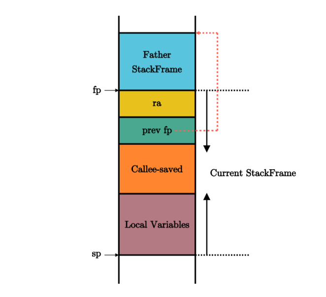
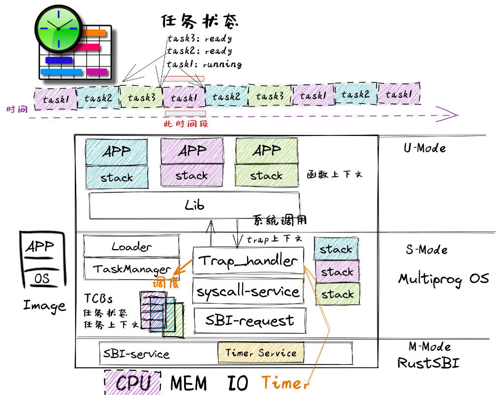

# rCore on Windows platform

## Installation

- rust : download rust from the default settings, and then set `rust-toolchain.toml` to specified the `nightly` version.
- qemu : the `qemu` version must be `7.0.0` [download the qemu](https://qemu.weilnetz.de/w64/2022/qemu-w64-setup-20220419.exe), otherwise, the startup address won't be `0x0000000`.

needing tools:

```cmd
rustup target add riscv64gc-unknown-none-elf
cargo install cargo-binutils
rustup component add llvm-tools-preview
rustup component add rust-src
```

and the gdb tool: [link](https://static.dev.sifive.com/dev-tools/riscv64-unknown-elf-gcc-8.3.0-2020.04.1-x86_64-w64-mingw32.zip)

## chapter

### Basic environment to run application


Here we implement the basic environment to run a application, print a "hello world" string at the qemu simulator console.

We remove the standard library of rust, only using the core library, and setting the `panic_handler`.

Introduction relevant bootstrap process in qemu.

In order for the implementation to properly interface with Qemu,
we can adjust the behavior of the linker through Linker Script(src/linker.ld) and set config(.cargo/config)

The basic theory of stack and calling the function in assemble.

```
jal  rd, imm[20:1]
rd <- pc + 4
pc <- pc + imm

jalr rd, (imm[11:0])rs
rd <- pc + 4
pc <- rs + imm


rs:  Source Register
rd:  Destination Register
(x0 ~ x31)

imm: Immediate
```

Function Call Context:

- Callee-Saved: used by callee
- Caller-Saved: used by caller

Register:
|register|saver|
|---|---|
|a0 ~ a7(x10 ~ x17) |callee|
|t0 ~ t6(x5 ~ x7, x28 ~ x31) |callee|
|s0 ~ s11(x8 ~ x9, x18 ~ x27) |caller|

zero(x0), ra(x1), sp(x2), fp(s0), gp(x3), tp(x4)



### With batch system


SEE: Supervisor Execution Environment

AEE: Application Execution Environment

Privilege-level software and hardware co-design

- `ecall`
- `eret`

privilege command:

- `sret`: S return to U.
- `wfi`: waiting for interrupt.
- `sfence.vma`: reflash TLB cache.
- visit `spec/stvec/scause/sscartch/stval/sstatus/stap` CSR instruction

and then, we write 5 program which running on user-space.

these programs can be test in linux platforms with `qemu-riscv64`, which the command can not find in windows.

The cache made by the CPU on the physical memory is divided into two parts:

- the data cache (d-cache)
- the instruction cache (i-cache)
  which are used when the CPU accesses and fetches the memory respectively.

Here we only notice that the privilege-level change only between RISCV-U and RISCV-S.

|csr name| function with Trap|
CSR(Control and status register)
|---|---|
|sstatus| current privilege-level type info|
|spec|if the current trap is an exception,record the last instruction address|
|scause|the reason for this trap|
|stval|the additional information about this trap|
|stvec|the entry point address of trap handler code|

```
stvec = MODE[1:0] + BASE[63:2]
MODE == 0 - Direct Mode
MODE -> Vectored
```

ecall -> u - Trap into - S

- sstatus.SPP -> U/S
- spec Trap next instruction address
- scause/stval record information
- CPU -> stvec, privilege-level set as S

sret -> s -> u

- sstatus.SPP -> U/S
- CPU -> spec

User stack and Kernel stack(Just wrapping the bytes array).

TrapContext

```rust
#[repr(C)]
pub struct TrapContext {
    pub x: [usize; 32],
    pub sstatus: Sstatus,
    pub sepc: usize,
}
```

General purpose register `x0~x31`, `sstatus`, `spec`.

The overall process of `Trap` processing is as follows:

- First save the Trap context on the kernel stack by `__alltraps`.
- Jump to `trap_handler` functions written in Rust to complete Trap distribution and processing.
- When `trap_handler` returns, use `__restore` to recover registers from the Trap context stored on the kernel stack.
- Finally, return to the application for execution through a `sret` instruction.

Instructions for reading and writing CSR are a class of instructions that can
complete multiple read and write operations without interruption.

### Multiprogramming and Time-Sharing Multitasking



