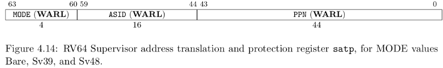

# rCore on Windows platform

## Installation

- rust : download rust from the default settings, and then set `rust-toolchain.toml` to specified the `nightly` version.
- qemu : the `qemu` version must be `7.0.0` [download the qemu](https://qemu.weilnetz.de/w64/2022/qemu-w64-setup-20220419.exe), otherwise, the startup address won't be `0x0000000`.

needing tools:

```cmd
rustup target add riscv64gc-unknown-none-elf
cargo install cargo-binutils
rustup component add llvm-tools-preview
rustup component add rust-src
```

and the gdb tool: [link](https://static.dev.sifive.com/dev-tools/riscv64-unknown-elf-gcc-8.3.0-2020.04.1-x86_64-w64-mingw32.zip)

## chapter

### Basic environment to run application


Here we implement the basic environment to run a application, print a "hello world" string at the qemu simulator console.

We remove the standard library of rust, only using the core library, and setting the `panic_handler`.

Introduction relevant bootstrap process in qemu.

In order for the implementation to properly interface with Qemu,
we can adjust the behavior of the linker through Linker Script(src/linker.ld) and set config(.cargo/config)

The basic theory of stack and calling the function in assemble.

```
jal  rd, imm[20:1]
rd <- pc + 4
pc <- pc + imm

jalr rd, (imm[11:0])rs
rd <- pc + 4
pc <- rs + imm


rs:  Source Register
rd:  Destination Register
(x0 ~ x31)

imm: Immediate
```

Function Call Context:

- Callee-Saved: used by callee
- Caller-Saved: used by caller

Register:
|register|saver|
|---|---|
|a0 ~ a7(x10 ~ x17) |callee|
|t0 ~ t6(x5 ~ x7, x28 ~ x31) |callee|
|s0 ~ s11(x8 ~ x9, x18 ~ x27) |caller|

zero(x0), ra(x1), sp(x2), fp(s0), gp(x3), tp(x4)


### With batch system


SEE: Supervisor Execution Environment

AEE: Application Execution Environment

Privilege-level software and hardware co-design

- `ecall`
- `eret`

privilege command:

- `sret`: S return to U.
- `wfi`: waiting for interrupt.
- `sfence.vma`: reflash TLB cache.
- visit `spec/stvec/scause/sscartch/stval/sstatus/stap` CSR instruction

and then, we write 5 program which running on user-space.

these programs can be test in linux platforms with `qemu-riscv64`, which the command can not find in windows.

The cache made by the CPU on the physical memory is divided into two parts:

- the data cache (d-cache)
- the instruction cache (i-cache)
  which are used when the CPU accesses and fetches the memory respectively.

Here we only notice that the privilege-level change only between RISCV-U and RISCV-S.

|csr name| function with Trap|
CSR(Control and status register)
|---|---|
|sstatus| current privilege-level type info|
|spec|if the current trap is an exception,record the last instruction address|
|scause|the reason for this trap|
|stval|the additional information about this trap|
|stvec|the entry point address of trap handler code|

```
stvec = MODE[1:0] + BASE[63:2]
MODE == 0 - Direct Mode
MODE -> Vectored
```

ecall -> u - Trap into - S

- sstatus.SPP -> U/S
- spec Trap next instruction address
- scause/stval record information
- CPU -> stvec, privilege-level set as S

sret -> s -> u

- sstatus.SPP -> U/S
- CPU -> spec

User stack and Kernel stack(Just wrapping the bytes array).

TrapContext

```rust
#[repr(C)]
pub struct TrapContext {
    pub x: [usize; 32],
    pub sstatus: Sstatus,
    pub sepc: usize,
}
```

General purpose register `x0~x31`, `sstatus`, `spec`.

The overall process of `Trap` processing is as follows:

- First save the Trap context on the kernel stack by `__alltraps`.
- Jump to `trap_handler` functions written in Rust to complete Trap distribution and processing.
- When `trap_handler` returns, use `__restore` to recover registers from the Trap context stored on the kernel stack.
- Finally, return to the application for execution through a `sret` instruction.

Instructions for reading and writing CSR are a class of instructions that can
complete multiple read and write operations without interruption.

### Multiprogramming and Time-Sharing Multitasking


We use python to build the linker script, we replace the application
start address with the correct address which i-th application should place
on.


Considering an one-time execution application as a `task`,
an `execution segment` or `idle segment` on a time segment
in the application execution process is called a
`computing task slice` or `idle task slice`.

Switching tasks from one program to another is called `task switching`.

The control flow between `Task switching` and `Trap` :

- It does not involve privilege level switching
- Part of it is done with the help of the compiler
- Same as `Trap`, it is transparent to the application

In fact, `Task switching` is a switch between the `Trap control flow` in the kernel from two different applications.

when an application trap into S-mode, this trap control flow can call
a special function `__switch`. After the `__switch` return, it will continue to execute the follow program segment.

That means the previous trap control of application A flow will be paused
and switch out. Then CPU will handle another trap control of
application B. And then at the right time, the trap control flow of application A will be switch back from the trap control flow of application C (maybe not the pervious his switch to).

Function `__switch` will change the `stack`.

When we doing the switching operation, we should stored some registers (Task Context). The `Task Context` will stored at `TaskManager` as a `TaskControlBlock`, responsibly for saving the state of a task.

```c
TaskContext *current_task_cx_ptr = &tasks[current].task_cx;
TaskContext *next_task_cx_ptr    = &tasks[next].task_cx;
```


```rust
pub struct TaskContext {
  ra: usize,
  sp: usize,
  s: [usize; 12],
}
```

- `ra`: It records where the `__switch` function should jump to continue execution after returning, so that it can get to the correct position after the task switch is completed and ret.
- `sp`: kernel stack pointer of app.
- `s`: Stored s0 ~ s11.

A `TaskControlBlock` contains: `TaskStatus`, `TaskContext`.

Interrupt of RISC-V:

- Software Interrupt
- Timer Interrupt
- External Interrupt

In the privilege level of S, interrupt mask - CSR has `sstatus` and `sie`.
`sie` has three type of interrupts: `ssie` / `stie` / `seie`.

when the interrupt happen,

- `sstatus.sie` will save at `sstatus.spie`, and `sstatus.sie` clear as zero.
- after completion of interrupt handler, `sret` will return to the place interrupted by the interrupt and continue execution. Hardware will recover the `sstatus.sie` with the value of `sstatus.spie`.

In RISC-V 64 architectures, there is a 64-bit counter CSR `mtime`.
another 64-bit counter CSR `mtimecmp`, if the value of `mtime` is exceed `mtimecmp`, it will cause a **timer interrupt**.


### Address Space

Rust data structures in heap:

- `*const T / *mut T`
- `&T / &mut T`
- `Box<T>`
- `Rc<T> / Arc<T>`
- `RefCell<T>`
- `Mutex<TJk>`

Smart Pointer / Container memory layout:  


using the crate `buddy_system_allocator` as heap allocator. and use `#[global_allocator]` for Semantic items tagged.

`buddy_system_allocator::LockedHeap` has implemented `GlobalAlloc` interface.

we use a static mut bytes array(in kernel .bss segment), as the heap area.

Address Virtualization:


with the help of hardware:

```
virtual address -> CPU.MMU(Memory Management Unit) -> Physical address
                        Address Translation
```

Segmented memory management:


- Every application address size limited to a const number `bound`, that is, each application virtual address range from $[0, bound)$.
- physical address was split into several slots of the same size, except of the kernel reserved space.
- Each slot has the base address and the visitable range $[base, base + bound)$.

In this case, MMU only need two registers: `base` and `bound`. And use a `Bitmap` to show the slots using status.

However, it may waste too much memory resources(Internal Fragment).

do some improve with different base/bound:

however, it also may waste too much memory(External Fragment).

Paged memory management:


- kernel do physical memory manage base on page.
- each application virtual address can be divided into serval virtual page.
- available physical memory are divided into serval physical as Frame.
- each application address are consist of serval virtual pages.

Concept:

- VPN: Virtual Page Number
- PPN: Physical Page Number
- Each application has his own `Page Table`(existing in memory, managed by kernel), recording each virtual page mapping the actual physical Frame.
- The `Page Table`, Key is VPN, Value is PPN.
- set the protection bit `rwx`

```
(VPN, Offset) -> MMU -> (PPN, Offset)
```

Here, we use `SV39` provided by riscv architecture.

In default, MMU is disabled.Modify a CSR `satp` to enable it.
After that, address which S mode or U mode would be all consider as a virtual address.It needs to translate into a physical address by MMU, and then visit the physical memory.And address in M mode would be consider as physical address.

`satp`:


- MODE: 0-visit physical address/8-Sv39
- ASID: Address space identifier.
- PPN: The physical page number where the root page table is located.

Address Format:


PTE, Page Table Entry:


- V(Valid): valid if current bit is 1
- R(Read)/W(Write)/X(Execute)
- U(User)
- G
- A(Accessed)
- D(Dirty)

Multilevel page table:

Allocation on demand, and using the `trie` algorithm.

- v == 0 => nullptr
- v == 1 && R/W/X == 0 => valid page table entry, containing ptr point at next page table entry.
- v == 1 && R/W/X |!= 0 => valid page table entry, containing the physical page number corresponding to the virtual address.

sv39 address transformation:


TLB, Translation Lookaside Buffer

`sfence.vma` + virtual address, only refresh this relevant mapping.

In enabling the Page management, when kernel code want to visit a virtual address, it should leave it to MMU to do physical address conversion. Giving each application kernel stack, and a `Trampoline`.


Each kernel stack would reserve a `Guard Page` as empty hole.


Application address space:


[More About Address Space](http://rcore-os.cn/rCore-Tutorial-Book-v3/chapter4/7more-as.html)
